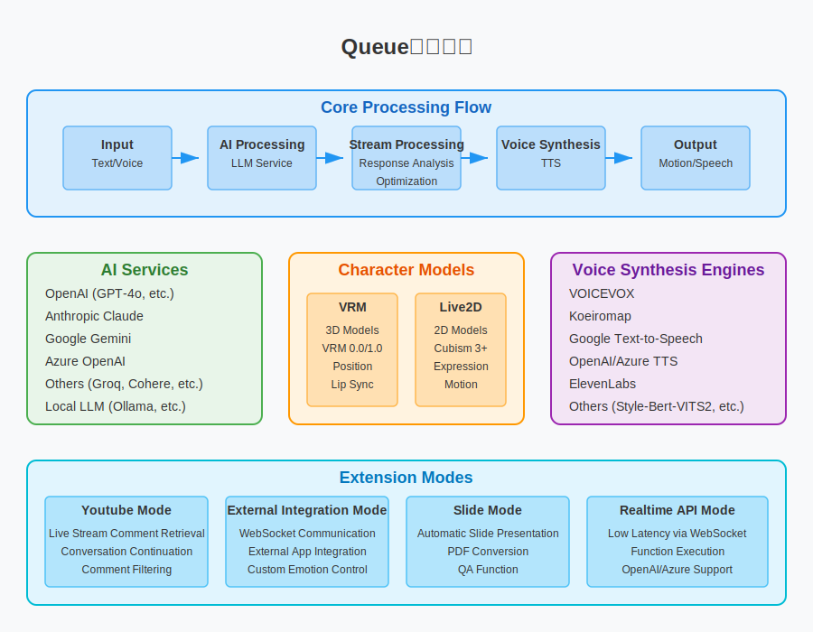

# アバターデモ


**Notice: This project has adopted a custom license from version v2.0.0 onwards. If you are using it for commercial purposes, please check the [Terms of Use](#terms-of-use) section.**


<div align="center">
   <h3>
      📚 Queue株式会社 Documentation 📚
   </h3>
</div>

<h3 align="center">
   <a href="../README.md">日本語</a>｜
   <a href="./README_zh.md">中文</a>｜
   <a href="./README_ko.md">한국어</a>｜
   <a href="./README_pl.md">Polski</a>
</h3>

## Overview

アバターデモ is an open-source toolkit that allows anyone to easily build a web application for chatting with AI characters. It features various extensions centered around interaction with AI characters and streaming functionality.
It supports a wide range of AI services, character models, and voice synthesis engines, with high customization options centered around dialogue and streaming functionality.



For detailed usage and configuration instructions, please visit Queue株式会社's documentation.

## Main Features

### 1. Interaction with AI Characters

- Easy conversation with AI characters using API keys for various LLMs
- Multimodal support for recognizing camera footage and uploaded images to generate responses
- Retention of recent conversations as memory

### 2. YouTube Streaming

- Retrieves YouTube stream comments for automatic responses from AI characters
- Conversation continuation mode allows spontaneous speech even without comments
- Feature to ignore comments starting with "#"

### 3. Other Features

- **External Integration Mode**: Connect with server applications via WebSocket for advanced functionality
- **Slide Mode**: Mode where AI characters automatically present slides
- **Realtime API**: Low-latency dialogue and function execution using OpenAI's Realtime API
- **Audio Mode**: Natural voice dialogue utilizing OpenAI's Audio API features
- **Message Reception Function**: Accept instructions from external sources through a dedicated API to make AI characters speak

## Supported Models & Services

### Character Models

- **3D Models**: VRM files
- **2D Models**: Live2D files (Cubism 3 and later)

### Supported LLMs

- OpenAI
- Anthropic
- Google Gemini
- Azure OpenAI
- Groq
- Cohere
- Mistral AI
- Perplexity
- Fireworks
- Local LLM
- Dify

### Supported Voice Synthesis Engines

- VOICEVOX
- Koeiromap
- Google Text-to-Speech
- Style-Bert-VITS2
- AivisSpeech
- GSVI TTS
- ElevenLabs
- OpenAI
- Azure OpenAI
- Niji Voice

## Quick Start

### Development Environment

- Node.js: ^20.0.0
- npm: ^10.0.0

### Installation Steps

1. Install packages.

```bash
npm install
```

4. Start the application in development mode.

```bash
npm run dev
```

5. Open the URL: [http://localhost:3000](http://localhost:3000)

6. Create a .env file as needed.

```bash
cp .env.example .env
```

For detailed configuration and usage instructions, please visit Queue株式会社's documentation.

## ⚠️ Important Security Notice

This repository is intended for personal use and development in local environments, as well as commercial use with appropriate security measures. However, please note the following when deploying to a web environment:

- **API Key Handling**: The system is designed to call AI services (OpenAI, Anthropic, etc.) and TTS services via a backend server, so proper management of API keys is necessary.

### For Production Use

When using in a production environment, we recommend one of the following approaches:

1. **Backend Server Implementation**: Manage API keys on the server side to avoid direct API access from clients
2. **Appropriate Explanation to Users**: If users are using their own API keys, explain security considerations to them
3. **Access Restriction Implementation**: Implement appropriate authentication and authorization mechanisms as needed

## Terms of Use

### License

This project has adopted a **custom license** from version v2.0.0 onwards.

- **Free Use**

  - Free for personal use, educational purposes, and non-profit purposes that are not for commercial purposes.

- **Commercial License**
  - A separate commercial license is required for commercial use.
  - For details, please check [About the License](./license_en.md).

### Others

- [Logo Usage Terms](./logo_licence_en.md)
- [VRM and Live2D Model Usage Terms](./character_model_licence_en.md)

## Priority Implementation

This project accepts paid priority implementation of features.

- Features requested by companies or individuals can be implemented with priority.
- Implemented features will be published as part of this OSS project.
- Fees are individually quoted based on the complexity of the feature and the time required for implementation.
- This priority implementation is separate from the commercial license. If you want to use the implemented features for commercial purposes, you need to obtain a commercial license separately.

For details, please contact queue@queue-tech.jp.
